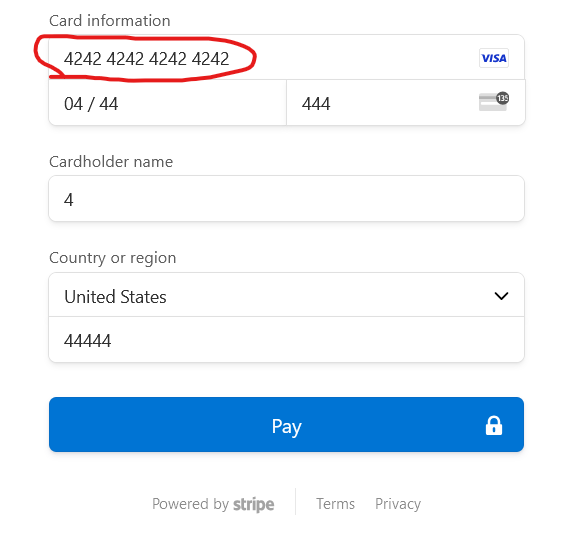

# PartsShop back-end
## Description

This is a nextJs backend for the PartsShop Capstone project


## Important! 
When testing stripe checkout use a fake visa card number: 
4242 4242 4242 4242
and a valid exparation date, everything else can be anything
like so:


## Pre-requisits
- Node.js v21.6.2
- Git
- Yarn
- Docker
  
## Installation

```bash
$ yarn install
```

## Running the app
Create an .env based on the sample.env

```bash
# run docker DB and pgadmin
$ docker-compose up-d

#initial migration
$ yarn m:run

# development
$ yarn dev

```

Example end point:
```bash
http://localhost:3000
```

## Using Swagger
Go to where your server is running with the route /api. \
In development that is :
``` bash
localhost:3000/api
```

For some endpoints authorization is required, for that use the register account endpoint, and then the login enpoint. Copy the access token.

Then Press the Autorize button on the top-right of swagger, and enter said token in there.

After that you can test endpoints as normal.


## Pushing to production
When there is a push to the "prod" branch, an image will be sent to AWS ECR. After that ssh into server and run the update script.


## Documentation
Further documentation can be found in the documentation folder.