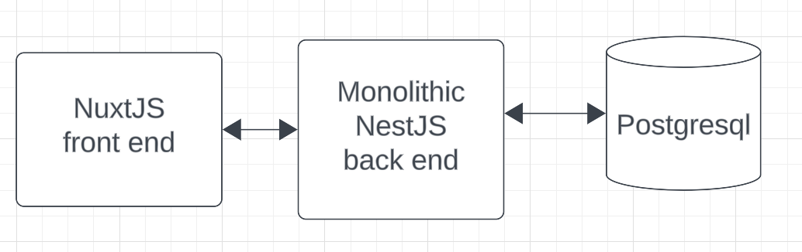
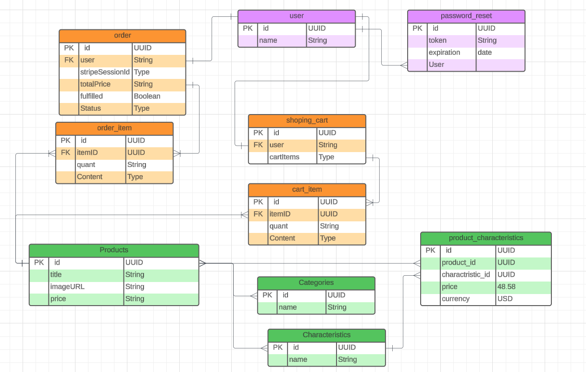

# PartsShop

Computer Part Store

---

Table of contents:
- [PartsShop](#partsshop)
  - [Overview](#overview)
  - [Architecture](#architecture)
  - [Frontend](#frontend)
  - [Backend](#backend)
  - [Database](#database)

  

## Overview

This Document describes the cloud architecture of PartsShop and the structure of its backend module. PartsShop is my capstone project.

PartsShop is a web store that "sells" computer parts, and evaluates if they are compatible with eachother.

The application is a webpage uses API calls to get the data from the back-end server, which querries the database for it.

## Architecture
PartsShop consists of four main components hosted on the AWS cloud:

1. The Frontend is a NuxtJS server-side web application, which communicates with the backend using API calls. It is hosted using AWS amplify;
2. The Backend is written using NestJS and has access to our database. It is hosted using AWS ec2;
3. Database is hosted using AWS RDS and is running as PostgreSQL;

## Frontend

PartsShop frontend lets users create an account, browse and add to cart different computer parts, and then go thorough a mock checkout.

The frontend gets all the data dynamically by sending API requests to the backend.

## Backend

The NestJS backend accepts the incoming API calls, queries the database for the required data, structures it, and returns the appropriate data for the student. 
To interact with the database we use Typeorm as our ORM, which means all our queries are protected from SQL injections.

Each module handles its own domain, ex. products are stored and accessed in the products module.

## Database

The ERD for the database looks like this:

**Product Storage** in green, is responsible for storing information about products.

**User** in purple, store all the registered users as well as their hashed passwords., 

**Cart/Order** contains information about all current carts, and previous orders.